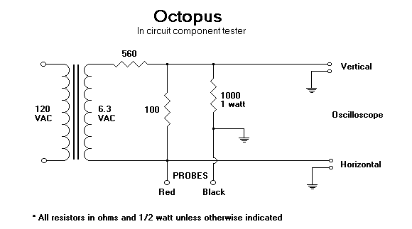
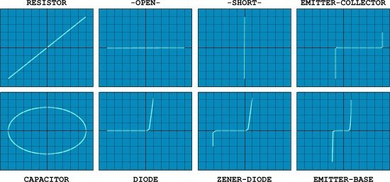
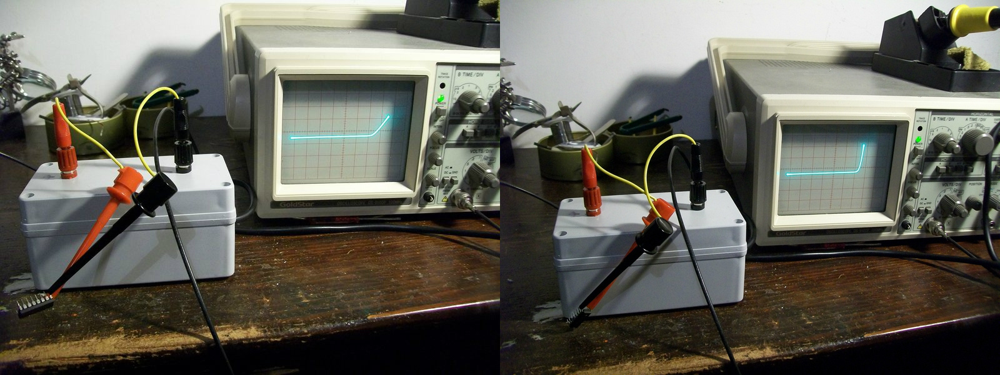

# Tipos-de-Cruve-Tracer

## Octopus

```link
https://www.jammarcade.net/simple-component-tester-a-k-a-octopus-curve-tracer/
```

<iframe maxwidth="360" maxheight="360" width="360" height="360"src="https://www.youtube.com/embed/3RjBFEKmt-g" title="YouTube video player" frameborder="0" allow="accelerometer; autoplay; clipboard-write; encrypted-media; gyroscope; picture-in-picture" allowfullscreen></iframe>

<iframe maxwidth="360" maxheight="360" width="360" height="360"src="https://www.youtube.com/embed/_FzBBtQk5RY" title="YouTube video player" frameborder="0" allow="accelerometer; autoplay; clipboard-write; encrypted-media; gyroscope; picture-in-picture" allowfullscreen></iframe>

Testador de componentes sujos e baratos (também conhecido como traçador de curva “Octopus”)

Você tem um osciloscópio e nunca o usa? Não venda, agora vou explicar como transformá-lo em um testador de componentes simples, mas eficaz.

O nome “Octopus” talvez não diga nada sozinho, mas se você pesquisar no Google junto com as palavras “curve tracer” você obterá milhares de resultados. Em poucas palavras, um curve tracer “Octopus” é um pequeno circuito usado em conjunto com um O osciloscópio permite exibir a tensão em um componente em teste no eixo horizontal (X) versus a corrente através desse componente no eixo vertical (Y). É necessário um osciloscópio configurado para o modo X-Y (a maioria deles possui esse recurso).

Existem muitas variantes do circuito “Octopus”, pessoalmente eu escolho este:



pois aplica pequena tensão (inferior a 1VAC) e corrente (inferior a 1mA) permitindo testar componentes não energizados também em circuito sem risco de danificá-los.

Como você pode ver na figura acima, o circuito é feito de poucas partes comuns: há um transformador de 120VAC para 6,3VAC (estou na Europa, então usei um de 220VAC), três resistores (o de 560 Ohm e o de 100 Ohm formam uma tensão divisor para obter 1VAC , então o de 1KOhm limita a corrente a 1mA) e duas sondas.

Este circuito produzirá uma forma de onda de "assinatura" no osciloscópio para auxiliar no teste e análise de curtos, aberturas e vazamentos em praticamente qualquer componente eletrônico, incluindo resistores, capacitores, indutores, diodos, transistores e ICs digitais também. uma forma de onda característica (chamada padrão “Lissajous”), alguns exemplos:



Agora, você deve estar se perguntando o que este dispositivo tem a ver com fliperama? Bem, pessoalmente, acho muito útil quando procuro ICs fora do circuito. resultados discordantes de meus testadores. Sondá-lo com o curve tracer e comparar seus padrões com os de um IC conhecido removeu todas as dúvidas:



À direita, o padrão gerado a partir de um IC bom (74LS367), à esquerda o do defeituoso. Especificamente, você pode ver como a junção (internamente um TTL contém transistores) de uma saída (PIN9) é enfraquecida em comparação com o bom um (o padrão não tem a forma saudável de 'L' de uma boa junção de diodo/base para coletor)

Obviamente, este traçador de curva também pode ser usado para testar componentes no circuito (graças à baixa tensão/corrente aplicada), mas neste caso é necessária experiência, pois os componentes podem interagir uns com os outros, produzindo resultados enganosos. A melhor opção seria ter uma boa placa como referência.

Se você quiser ler mais sobre, eu recomendo este documento:

<object data="./pdf/readme/octopus.pdf" type="application/pdf" width="100%" height="700px">
    <embed src="./pdf/readme/octopus.pdf">
        <p>This browser does not support PDFs. Please download the PDF to view it: <a href="https://tecnocrata-org.github.io/11.curvetracer/pdf/readme/octopus.pdf">Download PDF</a>.</p>
    </embed>
</object>
