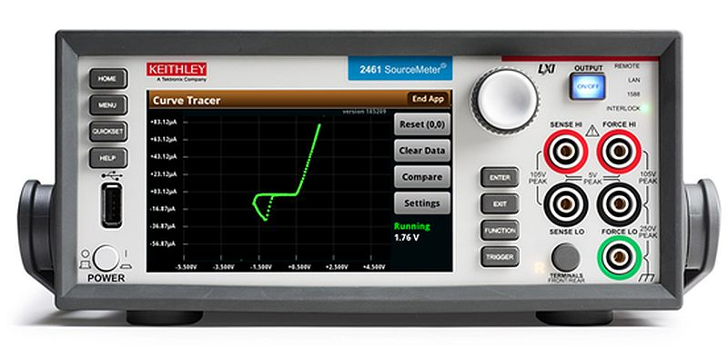

# Comerciais

## Tecktronik

```CMD
https://www.tek.com/en/blog/i-v-curve-tracer


Curve Tracer vs. I-V Curve Tracer Software


Um traçador de curva é um dispositivo de teste eletrônico fundamental usado para executar o rastreamento de curva I-V analisando as características de dispositivos semicondutores, como diodos, transistores, tiristores, etc. Eles são frequentemente usados em aplicações de confiabilidade de dispositivos, como análise de falhas e caracterização paramétrica.

A Tektronix introduziu o primeiro rastreador de curva do setor em 1955 para exibir curvas características para tubos de vácuo. Ao longo dos anos, modelos mais complexos e sofisticados foram lançados para testar transistores, diodos e outros dispositivos de estado sólido.


The Tektronix Type 576 curve tracer was introduced in 1969 and went on to broad industry acceptance. The vintageTEK museum uses this particular example for repairs in its restoration room. More details can be found [here](https://vintagetek.org/curve-tracers/)

The demand for classic curve tracers
These early models were—and are—still in demand for failure analysis and education applications. Their popularity is due in part to a simple interaction model that modern curve tracers have failed to replicate, including the user experience of simply “turning a knob” to have the curve displayed on the screen. Since these old Tektronix curve tracers are no longer manufactured, the sustained demand has led to a robust market for used traditional curve tracers with refurbished 370Bs fetching $20,000 or more in online auctions.

For labs that prefer to continue using traditional curve tracers, the reliance on vintage instrumentation presents its share of obstacles. Given the cost of usable old instruments, labs typically will share one unit across all their failure analysis engineers. Keeping existing instruments functional requires sourcing and stocking old replacement components, and the rather large footprint consumes limited lab space.  And forget about easily capturing and sharing data.

Modern I-V curve tracer configurations
Recognizing the need for an instrument  that more closely matches the classic Tektronix curve tracers, Tek and Keithley introduced two solutions. The first are the so called Keithley PCT (Parametric Curve Tracer configuration); they are [I-V curve tracer configurations](https://www.tek.com/en/products/keithley/semiconductor-test-systems/parametric-curve-tracer-configurations) that include everything the characterization engineer needs to develop a complete test system. Because these configurations are modular, they can be upgraded over time and the individual “building-block” instruments like [source measure units](https://www.tek.com/en/products/keithley/source-measure-units), can be used individually for other applications when needed. Though these configurations are the closest hardware equivalent to classic curve tracers, they are also a fairly large investment. And depending on a lab’s needs, a simpler solution exists.

I-V curve tracer software
Keithley recently introduced [I-V curve tracer software](https://www.tek.com/en/keithley-i-v-curve-tracer)that allows failure analysis engineers to use Keithley SourceMeter® Source Measure Units (SMU) to run tests originally done by classic curve tracers for two-terminals devices. Since an SMU can source voltage or current while also measuring voltage and current, it has the same hardware qualities as a curve tracer.

This new I-V curve tracer software leverages the intuitive touchscreen interface of [2400 Series Graphical SMUs](https://www.tek.com/en/products/keithley/source-measure-units/2400-graphical-series-sourcemeter) to recreate the familiar user experience of a curve tracer for low-power two-terminal devices. I-V Tracer uses the full capabilities of supported SMUs, including the dual high-speed digitizers of the 2461, to perform tracing with AC polarity and pulsed DC, in addition to standard DC polarity. This maps to the 576, for example, that had +DC, -DC, and AC polarities, which means the output is either +voltage, -voltage, or both + and - voltages.



Keithley I-V Tracer software leverages the touchscreen interface of 2400 Series Graphical SMUs to recreate the familiar user experience of a curve tracer for low-power two-terminal devices.

An economical approach to I-V curve tracing
Rather than pooling resources for shared, outdated equipment, labs can now equip individual engineers with their own I-V curve tracer. Keithley SMUs are portable and fit easily on test benches, as shown in the comparison with a 370B below. Moreover, users still have all the source, sink, and measure capabilities of Keithley SMUs with curve tracer functionality only a few clicks (or touches) away. It’s also easy to export curves or screenshots, and there’s no need to scour online listings for spare parts.

Keithley I-V Tracer software, along with an SMU, represents a cost-effective way to gain all the usability benefits of a classic curve tracer without the burden that comes with trying to maintain a vintage instrument.


An SMU with Keithley I-V Tracer software is a fraction the size of a classic curve tracer.

Applications for I-V curve tracer software
When it comes to failure analysis of semiconductor devices, I-V curve tracers are so popular in part because they provide precise control and immediate results. If you source too much power through a device, it’s possible to destroy the sensitive evidence that points to the root cause of failure. I-V Tracer simulates this functionality by providing direct control over the output level, letting failure analysis (FA) engineers slowly ramp up to an I-V curve anomaly then seamlessly creep into the behavior, with a minimum of 500 nV (or 500 fA) resolution on the sourced output. 

In addition to failure analysis, curve tracers have long been considered a must-have in engineering classrooms for their simplicity in allowing students to directly apply their learning to electrical devices. I-V Tracer with an SMU offers the same benefit, giving real-time, direct control to students allowing them to experiment and solidify understanding on a wide range of electronics.

To find the right solution for your application, explore our [I-V curve tracer configurations](https://www.tek.com/en/products/keithley/semiconductor-test-systems/parametric-curve-tracer-configurations) or learn more about Keithley’s [ I-V curve tracer software](https://www.tek.com/en/keithley-i-v-curve-tracer) and graphical [SMUs](https://www.tek.com/en/products/keithley/source-measure-units/2400-graphical-series-sourcemeter).
```

## alaonix

```CMD
https://www.alaonix.com/

```

## fados

```CMD
https://www.protarge.com/en/products/FADOS9F1
https://gsasindia.com/solutions/board-diagnostic-systems/field-testers/fados-9f1-fault-detector-and-oscilloscope-9-functions-in-1/

```
